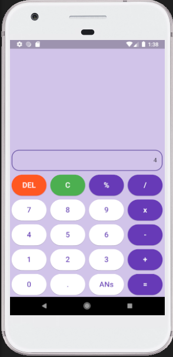
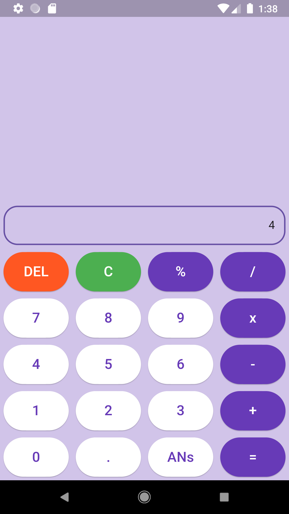

# calculator1




## Table of content

- [Inspiration](#inspiration)
- [Feature](#feature-)
- [Prerequisites](#prerequisites-)
- [Installation](#installation-)

## Inspiration
- UI : youtube Mitch Koko [whatch the video on youtube](https://www.youtube.com/watch?v=6TMrqyobrUo)
- Helper : chatGPT

## Feature :
 - Button : button number, operation math, delete, and clear
 - Text Filed : field text for output number

## Prerequisites :
 - Flutter version 3.22.1

## Installation :
1. Clone the repositories
```bash
 git clone https://github.com/robbymaul/calculator1
```
2. Running project
```dart
 flutter run
```

## Work :
- Build : 2 days

## Lack of Features :
- Handle : cannot handle double or decimal
